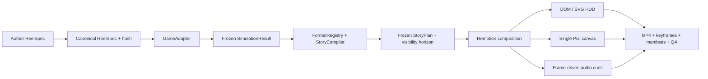

# Casino Reel Builder

Локальный TypeScript-пайплайн для детерминированной генерации вертикальных casino/game-show reels из versioned JSON-конфига и frozen simulation artifacts.

Текущий релиз `0.1.1` реализует:

- полностью анимированный 16-секундный P0 `survive-500` в оригинальной теме `Carnival Night`;
- Remotion timeline, DOM/SVG HUD и графики, один вручную управляемый PixiJS/WebGL canvas для wheel/stage/FX;
- seedable `approximate-v0` за сменным `GameAdapter`;
- сериализуемые `ReelSpec → SimulationResult → StoryPlan → RenderManifest` с canonical hashes;
- temporal truth на каждом кадре;
- семь format fixtures и четыре общих story/simulation kernels;
- CLI, batch isolation, provenance gates, golden frames, contact sheets, MP4/FFmpeg QA и ручной visual review.

`approximate-v0` — только иллюстративная модель. Она не описывает реальные odds какой-либо коммерческой игры.

## Быстрый старт

Закреплённое окружение: macOS arm64, Node `22.14.0`, pnpm `10.8.1`, локальный Google Chrome. Версии JS-зависимостей зафиксированы в `pnpm-lock.yaml`.

```bash
pnpm install --frozen-lockfile
pnpm assets:generate
pnpm reel doctor
pnpm check
```

Собрать P0:

```bash
pnpm reel render specs/examples/survive-500.json --profile draft
pnpm reel render specs/examples/survive-500.json --profile final
```

Проверить все семь форматов:

```bash
pnpm reel batch batches/all-formats-smoke.json --profile draft --jobs 2
```

Полный CLI:

```text
pnpm reel validate <spec>
pnpm reel simulate <spec> [--seed <seed>]
pnpm reel compile <spec|simulation.json|build>
pnpm reel preview <spec|build>
pnpm reel contact-sheet <spec|render-manifest.json|build> [--profile draft|final|public]
pnpm reel render <spec|render-manifest.json|build> [--profile draft|final|public]
pnpm reel batch <batch.json> [--profile ...] [--jobs N] [--render]
pnpm reel doctor
```

`preview`, `contact-sheet` и `render` читают те же frozen artifacts; отдельной mock-логики для UI нет.

## Проверенный результат

Актуальный final build: `output/survive-500-demo/b-050b7893f9f1/`.

- `video/final.mp4` — 1080×1920, H.264, yuv420p BT.709, CFR 30, 16.000 s, AAC stereo 48 kHz;
- `preview/contact-sheet.jpg` — семь story-selected golden frames;
- `preview/keyframes/` — master, 360×640 и строгие 270×480 варианты;
- `qa/report.json` — 21/21 automated gates;
- `qa/visual-review.json` — `APPROVED`, 39/40, без Blocker/Major;
- `run-manifest.json` — версии, hashes, delivery contract, assets/provenance и статусы.

`output/` намеренно исключён из git: все артефакты воспроизводятся командами выше.

## Архитектура



Точка замены математики — интерфейс `src/game/game-adapter.ts` и registry `src/game/registry.ts`. Новый verified/replay adapter обязан выпускать тот же `SimulationResultV1`; story, renderer и CLI менять не нужно.

## Документация

Исходные спецификации находятся в `docs/00`–`docs/11`. Фактическое состояние, команды, проверки и remaining TODO собраны в [HANDOFF.md](HANDOFF.md). Проектный арт-дирекшн и review rubric — в [skills/direct-casino-reels/SKILL.md](skills/direct-casino-reels/SKILL.md).
