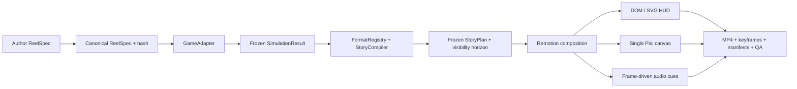

# Casino Reel Builder

Локальный TypeScript-пайплайн для детерминированной генерации вертикальных casino/game-show reels из versioned JSON-конфига и frozen simulation artifacts.

Текущий релиз `0.1.2` реализует:

- полностью анимированный 18-секундный P0 `survive-500` с Crazy Time editorial forecast, 1,000 прогонами и тремя итоговыми tiers;
- Remotion timeline, DOM/SVG HUD и графики, один вручную управляемый PixiJS/WebGL canvas для wheel/stage/FX;
- seedable `approximate-v0` за сменным `GameAdapter`;
- сериализуемые `ReelSpec → SimulationResult → StoryPlan → RenderManifest` с canonical hashes;
- temporal truth на каждом кадре;
- семь format fixtures и четыре общих story/simulation kernels;
- CLI, batch isolation, provenance gates, golden frames, contact sheets, MP4/FFmpeg QA и ручной visual review.

`approximate-v0` — только иллюстративная модель. Она не описывает реальные odds какой-либо коммерческой игры.

## Быстрый старт

Закреплённое окружение: macOS arm64, Node `22.14.0`, pnpm `10.8.1`, локальный Google Chrome. Версии JS-зависимостей зафиксированы в `pnpm-lock.yaml`.

```bash
pnpm install --frozen-lockfile
pnpm assets:generate
pnpm reel doctor
pnpm check
```

Собрать P0:

```bash
pnpm reel render specs/examples/survive-500.json --profile draft --try 1
pnpm reel render specs/examples/survive-500.json --profile final --try 1
```

## Попытки и финально принятые ролики

`experiment.attempt` входит в frozen ReelSpec. Для одной и той же математической модели каждая попытка получает отдельный seed потока случайности, simulation hash и build, а повтор конкретного `--try N` остаётся воспроизводимым:

```bash
# Явный номер
pnpm reel render specs/examples/survive-500.json --profile draft --try 27

# Автоматически следующий номер для этого формата
pnpm reel render specs/examples/survive-500.json --profile final --next-try
```

Во всех кадрах показывается casino-бейдж `TRY #N`. Выходной MP4 получает компактное имя вида `survive500-try27.mp4`.

После просмотра принять прошедший final/public build:

```bash
pnpm reel accept output/survive-500-demo/<build-id>
```

Команда копирует ролик в `final-videos/<format>/`, рядом сохраняет JSON-квитанцию с версией модели, QA-статусом и хэшами. Draft и failed-QA принять нельзя; существующий `format + try` нельзя случайно перезаписать другим видео. Папки создаются динамически, поэтому будущие пять форматов и новая математическая модель не требуют изменений этого workflow.

Проверить все семь форматов:

```bash
pnpm reel batch batches/all-formats-smoke.json --profile draft --jobs 2
```

Полный CLI:

```text
pnpm reel validate <spec> [--try N|--next-try]
pnpm reel simulate <spec> [--seed <seed>] [--try N|--next-try]
pnpm reel compile <spec|simulation.json|build> [--try N|--next-try]
pnpm reel preview <spec|build> [--try N|--next-try]
pnpm reel contact-sheet <spec|render-manifest.json|build> [--profile ...] [--try N|--next-try]
pnpm reel render <spec|render-manifest.json|build> [--profile ...] [--try N|--next-try]
pnpm reel accept <render-manifest.json|build>
pnpm reel batch <batch.json> [--profile ...] [--jobs N] [--render]
pnpm reel doctor
```

`preview`, `contact-sheet` и `render` читают те же frozen artifacts; отдельной mock-логики для UI нет.

## Проверенный результат

Актуальный internal review master: `output/survive-500-demo/b-30c3b4440d72/`.

- `video/final.mp4` — 1080×1920, H.264, yuv420p BT.709, CFR 30, 18.000 s, AAC stereo 48 kHz;
- `preview/contact-sheet.jpg` — семь story-selected golden frames;
- `preview/keyframes/` — master, 360×640 и строгие 270×480 варианты;
- `qa/report.json` — 19 технических гейтов passed; два rights/brand гейта намеренно блокируют public/commercial release;
- `run-manifest.json` — версии, hashes, delivery contract, assets/provenance и статусы.

Master предназначен только для internal review: Crazy Time logo, presenter reference и ElevenLabs Free assets требуют clearance или замены до публикации.

`output/` намеренно исключён из git: все артефакты воспроизводятся командами выше.

## Архитектура



Точка замены математики — интерфейс `src/game/game-adapter.ts` и registry `src/game/registry.ts`. Новый verified/replay adapter получает готовый `simulationSeed` конкретной попытки и обязан выпускать тот же `SimulationResultV1`; story, renderer, attempt workflow и CLI менять не нужно.

## Документация

Исходные спецификации находятся в `docs/00`–`docs/11`. Нормативная публичная реконструкция Crazy Time Global, legacy editorial preset и прогнозные модели ещё четырёх live game shows описаны в [docs/12-game-model-forecasts.md](docs/12-game-model-forecasts.md). Фактическое состояние, команды, проверки и remaining TODO собраны в [HANDOFF.md](HANDOFF.md). Проектный арт-дирекшн и review rubric — в [skills/direct-casino-reels/SKILL.md](skills/direct-casino-reels/SKILL.md).
